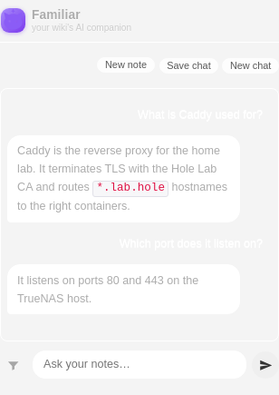

<div align="center">


# Familiar

**An AI familiar for your wiki.**

Streaming AI chat, note summaries, tag & task suggestions, and related-note
discovery for **any** [TiddlyWiki](https://tiddlywiki.com) — backed by a
self-hosted gateway, so your notes never leave your own infrastructure.

</div>

---

Familiar is two pieces:

- **The plugin** (`plugins/mblackman/familiar/`) — a drag-and-drop TiddlyWiki
  plugin that adds an *Ask* sidebar, an in-note chat composer, and per-note
  *Summarize* / *Suggest tags* / *Extract tasks* / *Related notes* actions.
- **The gateway** — a small FastAPI service that does the RAG retrieval and
  talks to your LLM (Gemini, or a fully-local Ollama backend). It holds **no
  wiki credentials and runs no browser**: the plugin sends note content in each
  request, minimized through a content-addressed cache so unchanged notes cost
  a few bytes per question.

Because the wiki supplies its own content, every feature works against *any*
TiddlyWiki the plugin is installed in — no per-wiki server config.

<div align="center">

</div>

## Features

| | |
|---|---|
| **Ask your notes** | Sidebar chat with streaming answers, a collapsible source list, and an optional TiddlyWiki filter to scope which notes are searched. |
| **Saved & in-note chats** | Persist a conversation as a regular note (one tiddler per turn) that syncs and survives reload; tag any note `ai-chat` to chat right inside it. |
| **Summarize** | Toolbar button on any tiddler — writes an AI summary to a `summary` field, shown above the body. |
| **Suggest tags / Extract tasks** | One-click suggestions drawn from the note's rendered text; tags are proposed from your existing tag vocabulary. |
| **Related notes** | Embeddings-based "notes like this one" for the open tiddler. |

## Install

### Plugin

1. Build the bundle (or grab `familiar.tid` from a [release](https://github.com/mblackman/tiddly-familiar/releases)):
   ```bash
   npm run build-plugin      # writes build/familiar.tid
   ```
2. Drag `build/familiar.tid` onto your wiki and save. Requires TiddlyWiki ≥ 5.3.0.
3. Open **Control Panel → Settings → Familiar** and set the **Gateway URL**
   (and **API key**, if your gateway uses one). Settings apply on the next
   request — no reload needed.

> Upgrading from the old `ai-gateway` plugin? Familiar migrates your saved
> settings automatically on first startup; just uninstall the old plugin.

### Gateway

```bash
cp .env.example .env        # set GEMINI_API_KEY (or LLM_BACKEND=ollama), GATEWAY_API_KEY
docker compose up -d --build
```

The gateway listens on `:8787`. Point the plugin's **Gateway URL** at it
(e.g. `http://localhost:8787`).

## Configuration

**Plugin** (Control Panel → Settings → Familiar):

| Setting | Purpose | Default |
|---|---|---|
| Gateway URL | Base URL of the gateway | `http://localhost:8787` |
| API key | Sent as `X-API-Key`; matches the gateway's `GATEWAY_API_KEY` | *(empty)* |
| Chat note template | Title for new chat notes — tokens `{name}` / `{date}` / `{time}` | `AI Chat: {name}` |

**Gateway** (env-only, via `.env`):

| Var | Purpose |
|---|---|
| `GATEWAY_API_KEY` | Shared secret required on requests (optional) |
| `GEMINI_API_KEY`, `GEMINI_MODEL` | Gemini generation (default backend) |
| `LLM_BACKEND=ollama`, `OLLAMA_LLM_MODEL`, `OLLAMA_URL` | Fully-local generation instead of Gemini |
| `EMBED_MODEL`, `RAG_TOP_K`, `PROFILES_DIR` | Embedding model, retrieval depth, data dir |

## How it works

Each request carries the wiki's own notes. Every note is hashed (sha256); the
plugin asks the gateway which hashes it's missing and sends only those in full —
so a follow-up question over an unchanged corpus is almost entirely hash refs.
Retrieval is hybrid (embedding cosine + keyword overlap) over 2k-char chunks,
and answers stream back over Server-Sent Events.

Request budgets (mirrored on both sides): at most 500 notes per question, 50k
characters per note, 2M characters total — overflow is dropped and the answer
notes how many notes were searched.

## License

See repository for license details.
